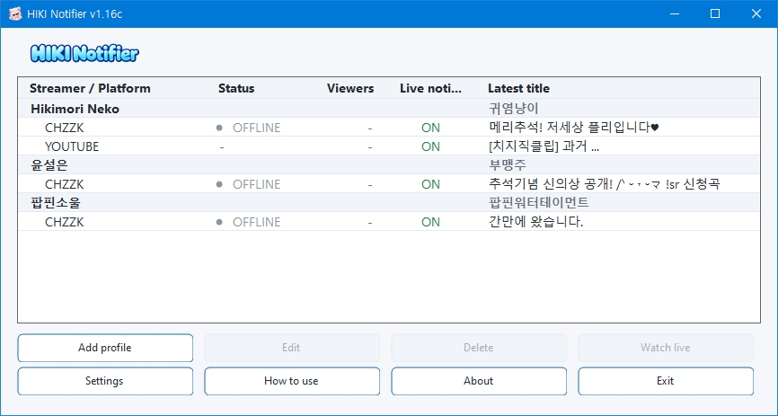
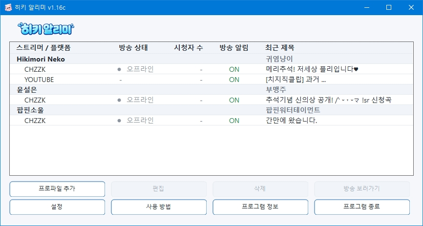
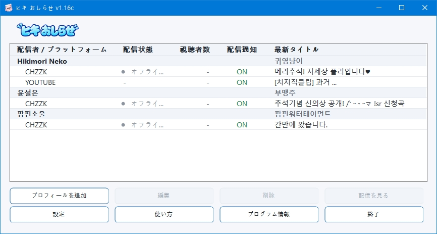

# HIKI Notifier

**English | [한국어](#한국어) | [日本語](#日本語)**

A lightweight Windows notification utility for multiple streaming platforms.

**Supported platforms:** CHZZK · YouTube · RPLAY · Twitch · SOOP · CIME

### Platform support

- **CHZZK** — LIVE status, stream title, viewer count, and live notifications
- **YouTube** — New video and Shorts notifications
- **RPLAY** — LIVE status and live notifications
- **Twitch** — LIVE status and live notifications
- **SOOP** — LIVE status and live notifications
- **CIME** — LIVE status, stream title, viewer information, and live notifications

HIKI Notifier includes a built-in **Hikimori Neko** profile with linked CHZZK and YouTube channels.  
Additional streamer profiles and channels can also be registered manually.

No account login is required for supported platform monitoring.

> **Unofficial fan-made utility**  
> HIKI Notifier is not affiliated with or endorsed by any supported platform or its operator.

---

## Screenshot



---

## Features

- LIVE / OFFLINE / UNKNOWN status monitoring for supported live-stream platforms
- Desktop notifications when registered channels go LIVE
- Platform-dependent stream title and viewer information
- YouTube new video and Shorts notifications
- Latest YouTube content title display
- Built-in Hikimori Neko profile with CHZZK and YouTube channels
- Multiple streamer profiles
- Multiple linked channels per streamer profile
- Per-channel notification ON / OFF
- Optional per-channel automatic stream-page opening when a broadcast starts
- Immediate one-time notification replay when alerts are re-enabled and relevant current information is available
- Open streams or YouTube content directly from the notification window
- System tray operation
- Optional startup with Windows
- Built-in notification sound
- Custom WAV notification sound
- Silent mode
- Adjustable notification window opacity from 50% to 100%
- Notification test from the Settings window
- Dynamic INI language pack discovery
- English, Korean, and Japanese language packs included
- No account login required

---

## Basic Usage

### 1. Download and run

Download the latest ZIP file from the **Releases** section.

Current release:

`HIKI Notifier 1.16c.zip`

Extract the ZIP file to any folder and run:

`HIKI Notifier.exe`

No installer is required.

---

### 2. Built-in Hikimori Neko profile

The **Hikimori Neko** profile is included automatically.

It contains built-in CHZZK and YouTube channels.

The built-in profile and its predefined channel addresses are protected from deletion or modification.

Notification settings can still be enabled or disabled individually.

---

### 3. Add another streamer profile

Press **Add Profile** in the main window.

Choose a supported platform and enter:

- Streamer name
- Optional memo
- One or more linked channel URLs

CHZZK example:

```text
https://chzzk.naver.com/live/CHANNEL_ID
```

YouTube example:

```text
https://www.youtube.com/@HANDLE
```

A single streamer profile can contain multiple linked channels from supported platforms.

---

### 4. Receive notifications

For supported live-stream platforms, a desktop notification is displayed when a registered channel goes LIVE.

Depending on the platform, the notification can include:

- Streamer name
- Stream title
- Current viewer count

For YouTube, HIKI Notifier can notify you when a new video or Shorts content is detected.

The YouTube notification includes the content title and a button to open the content in your default browser.

Only the explicit **Watch / Open** button opens the browser.  
Clicking other parts of the notification window does not open a page.

---

## Main Window

The main list groups linked channels under each streamer profile.

Depending on the platform, the list can display:

- Streamer / platform
- Stream status
- Viewer count
- Notification ON / OFF
- Current stream title or latest content title

Select a channel row to use the actions available for that channel.

Notification settings can also be changed from the profile editor and the system tray menu.

---

## Streamer Profiles

Profiles are organized by streamer rather than by individual platform.

One streamer profile can contain multiple linked channels.

For example:

```text
Hikimori Neko
├─ CHZZK
└─ YouTube
```

Each profile can also contain a memo for personal identification or notes.

Channel notification settings are managed individually.

---

## Notification Settings

Notifications can be enabled or disabled separately for each linked channel.

When a notification setting is manually changed from:

`OFF → ON`

HIKI Notifier can immediately replay the currently relevant notification once.

For supported live-stream platforms:

- If the channel is currently LIVE and valid live information is available, the current live notification is shown once.
- If the channel is OFFLINE or UNKNOWN, no notification is shown.

For YouTube:

- If valid latest content information is already available, the latest content notification is shown once.

This replay does not mark the stream or video as newly detected and does not cause duplicate automatic notifications.

Restoring an enabled notification setting when the application starts does not trigger a replay.

---

## Automatic Stream Page Opening

Each supported live channel can optionally open its stream page automatically when a broadcast starts.

This option is managed per channel and is disabled by default.

Automatic opening is triggered by a newly detected:

`OFFLINE → LIVE`

transition.

It does not automatically open a page simply because:

- The application starts while a channel is already LIVE
- A channel state changes from UNKNOWN to LIVE
- A notification setting is toggled

---

## Notification Appearance

The notification window opacity can be adjusted from the Settings window.

Available range:

`50% → 100%`

The current value is displayed as a percentage.

The setting applies to actual platform notifications and notification tests.

You can use **Notification Test** to preview the current appearance before saving the settings.

---

## Notification Sound

The following notification sound modes are available:

- Built-in notification sound
- Custom WAV file
- Silent

Notification sound settings can be changed from the Settings window.

---

## YouTube Monitoring

HIKI Notifier monitors newly published YouTube videos and Shorts without requiring a Google or YouTube login.

The application normally uses the public YouTube feed for lightweight monitoring.

If the feed is temporarily unavailable, HIKI Notifier can fall back to the channel's public **Videos** and **Shorts** pages and detect new content from publicly available channel data.

Previously processed video IDs are retained to prevent duplicate notifications, including after the normal feed becomes available again.

Because this feature depends on public YouTube feeds and page structures, future changes made by YouTube may require updates to HIKI Notifier.

---

## System Tray

Closing or minimizing the main window does **not** exit HIKI Notifier.

The application continues running in the Windows system tray.

From the tray menu you can:

- Open HIKI Notifier
- Access available channel actions
- Enable or disable channel notifications
- Open available stream/content pages
- Open program information
- Exit the application

To completely close HIKI Notifier, right-click the tray icon and select **Exit**.

---

## Start with Windows

HIKI Notifier can optionally start automatically with Windows.

This option can be enabled or disabled from the Settings window.

When started automatically, HIKI Notifier can remain in the system tray without requiring the main window to stay open.

---

## Stream Status Monitoring

HIKI Notifier periodically checks the current status of registered channels on supported live-stream platforms.

Possible states include:

- LIVE
- OFFLINE
- UNKNOWN

Temporary network errors are not automatically treated as OFFLINE.

This helps prevent incorrect state changes and repeated notifications caused by temporary connection problems.

---

## Languages

HIKI Notifier includes:

- English
- 한국어
- 日本語

Additional language packs can be added without rebuilding the application.

Language files are automatically discovered from:

```text
lang\*.ini
```

Each language pack identifies itself using metadata such as:

```ini
[Language]
Name=日本語
Code=ja
```

After a valid language file is added, it automatically appears in the language selection list.

If a translation key is missing from an additional language pack, the English language pack is used as a fallback.

This also allows users to create and share their own translations without modifying the program itself.

---

## System Requirements

- 64-bit Windows 10 or Windows 11
- x64 processor
- .NET Framework 4.8

---

## Download

Download the latest version from the **Releases** section of this repository.

Current release:

`HIKI Notifier 1.16c.zip`

Extract the ZIP file and run:

`HIKI Notifier.exe`

No installer is required.

---

## Development

HIKI Notifier is built with:

- C#
- .NET Framework 4.8
- Windows Forms
- x64

The application is designed to remain lightweight while continuously monitoring registered channels in the background.

---

## Version

Current version:

**1.16c**

---

## Developer

**Eltax**

---

## Special Thanks

### Hikimori Neko

The person who inspired this project.

---

## Disclaimer

HIKI Notifier is an unofficial fan-made utility.

It is not affiliated with or endorsed by any supported platform or its operator.

All service names and trademarks belong to their respective owners.

Changes to service APIs, public feeds, or web structures may cause some features to stop working correctly.

---

## License

No open-source license is currently provided for this repository.

**Copyright © Eltax. All rights reserved.**

Third-party trademarks, service names, and externally sourced assets remain subject to the rights and license terms of their respective owners.

---

# 한국어

**[English](#hiki-notifier) | 한국어 | [日本語](#日本語)**

**HIKI Notifier**는 여러 스트리밍 플랫폼의 방송 및 새 콘텐츠를 확인하기 위한  
가벼운 Windows용 알림 유틸리티입니다.

**지원 플랫폼:** CHZZK · YouTube · RPLAY · Twitch · SOOP · CIME

### 플랫폼별 지원 기능

- **CHZZK** — 방송 상태, 방송 제목, 시청자 수 및 방송 시작 알림
- **YouTube** — 새 영상 및 Shorts 알림
- **RPLAY** — 방송 상태 및 방송 시작 알림
- **Twitch** — 방송 상태 및 방송 시작 알림
- **SOOP** — 방송 상태 및 방송 시작 알림
- **CIME(씨미)** — 방송 상태, 방송 제목, 시청자 정보 및 방송 시작 알림

**Hikimori Neko**의 치지직 및 YouTube 채널이 연결된 기본 프로파일이 포함되어 있으며,  
원하는 다른 스트리머와 채널도 직접 등록할 수 있습니다.

지원 플랫폼의 방송 상태 확인에는 계정 로그인이 필요하지 않습니다.

> **비공식 팬메이드 유틸리티**  
> HIKI Notifier는 지원 플랫폼 또는 관련 운영사의 공식 프로그램이 아닙니다.

---

## 스크린샷



---

## 주요 기능

- 지원 라이브 플랫폼의 LIVE / OFFLINE / UNKNOWN 상태 확인
- 등록된 라이브 채널 방송 시작 시 데스크톱 알림
- 플랫폼에 따라 방송 제목 및 현재 시청자 수 표시
- YouTube 새 영상 및 Shorts 알림
- YouTube 최신 콘텐츠 제목 표시
- Hikimori Neko 치지직 + YouTube 기본 프로파일
- 여러 스트리머 프로파일 등록
- 하나의 스트리머에 여러 채널 연결
- 스트리머별 메모 작성
- 채널별 알림 ON / OFF
- 채널별 **방송 시작 시 페이지 자동 열기** 옵션
- 알림을 OFF → ON으로 다시 켰을 때 현재 유효한 알림을 즉시 1회 재표시
- 알림창에서 방송 또는 YouTube 콘텐츠 바로 열기
- 시스템 트레이 상주
- Windows 시작 시 자동 실행 옵션
- 프로그램 기본 알림음
- 사용자 지정 WAV 알림음
- 무음 모드
- 알림창 투명도 50~100% 조절
- 설정창 알림 테스트
- INI 언어팩 자동 인식
- English / 한국어 / 日本語 언어팩 기본 제공
- 계정 로그인 없이 사용 가능

---

## 기본 사용법

### 1. 다운로드 및 실행

이 저장소의 **Releases** 메뉴에서 최신 ZIP 파일을 다운로드합니다.

현재 배포 버전:

`HIKI Notifier 1.16c.zip`

원하는 폴더에 압축을 풀고:

`HIKI Notifier.exe`

를 실행하면 됩니다.

별도의 설치 프로그램은 필요하지 않습니다.

---

### 2. Hikimori Neko 기본 프로파일

**Hikimori Neko** 프로파일은 프로그램에 기본으로 포함되어 있습니다.

기본 프로파일에는 치지직과 YouTube 채널이 연결되어 있습니다.

기본 프로파일과 기본 채널 주소는 삭제하거나 변경할 수 없습니다.

각 채널의 알림 ON / OFF 설정은 자유롭게 변경할 수 있습니다.

---

### 3. 다른 스트리머 프로파일 추가

메인 화면에서 **프로파일 추가** 버튼을 누릅니다.

지원 플랫폼을 선택한 뒤 다음 정보를 입력할 수 있습니다.

- 스트리머 이름
- 선택 사항인 메모
- 하나 이상의 연결 채널 주소

치지직 예:

```text
https://chzzk.naver.com/live/CHANNEL_ID
```

YouTube 예:

```text
https://www.youtube.com/@HANDLE
```

하나의 스트리머 프로파일에 지원 플랫폼의 여러 채널을 연결할 수 있습니다.

---

### 4. 알림 받기

지원되는 라이브 플랫폼의 등록 채널이 방송을 시작하면 데스크톱 알림창이 표시됩니다.

플랫폼에 따라 다음 정보를 확인할 수 있습니다.

- 스트리머 이름
- 방송 제목
- 현재 시청자 수

YouTube에서는 새 영상 또는 Shorts가 확인되면 새 콘텐츠 알림이 표시됩니다.

YouTube 알림에는 콘텐츠 제목과 해당 콘텐츠를 기본 브라우저에서 여는 버튼이 표시됩니다.

브라우저는 명시적인 **보러가기 / 열기** 버튼을 눌렀을 때만 열립니다.  
알림창의 다른 부분을 클릭해도 브라우저는 열리지 않습니다.

---

## 메인 화면

메인 목록은 스트리머별로 연결된 채널을 묶어서 표시합니다.

플랫폼에 따라 다음 정보를 확인할 수 있습니다.

- 스트리머 / 플랫폼
- 방송 상태
- 시청자 수
- 알림 ON / OFF
- 현재 방송 제목 또는 최신 콘텐츠 제목

채널 행을 선택하면 해당 채널에서 사용할 수 있는 기능을 실행할 수 있습니다.

알림 설정은 프로파일 편집창과 시스템 트레이에서도 변경할 수 있습니다.

---

## 스트리머 프로파일

HIKI Notifier는 플랫폼마다 별도의 프로파일을 만드는 대신  
하나의 스트리머 아래 여러 채널을 연결하는 구조를 사용합니다.

예:

```text
Hikimori Neko
├─ CHZZK
└─ YouTube
```

프로파일에는 스트리머를 구분하기 위한 메모도 작성할 수 있습니다.

각 연결 채널의 알림 설정은 개별적으로 관리됩니다.

---

## 알림 설정

각 연결 채널마다 알림을 개별적으로 켜거나 끌 수 있습니다.

사용자가 직접 알림을:

`OFF → ON`

으로 변경하면 현재 다시 표시할 수 있는 유효한 알림이 있는 경우 즉시 1회 재표시합니다.

지원되는 라이브 플랫폼의 경우:

- 현재 LIVE이며 유효한 방송 정보가 존재 → 현재 방송 알림 1회 재표시
- OFFLINE / UNKNOWN → 알림 없음

YouTube의 경우:

- 현재 유효한 최신 콘텐츠 정보가 존재 → 최신 콘텐츠 알림 1회 재표시

이 기능은 새로운 방송이나 콘텐츠를 다시 감지한 것으로 처리하지 않기 때문에  
자동 알림 중복은 발생하지 않습니다.

프로그램 시작 시 저장된 ON 상태를 복원하는 것만으로는 재알림하지 않습니다.

---

## 방송 시작 시 페이지 자동 열기

지원되는 각 라이브 채널별로 방송이 시작될 때 해당 방송 페이지를 자동으로 열도록 설정할 수 있습니다.

이 옵션은 채널별로 관리되며 기본값은 OFF입니다.

페이지 자동 열기는 새롭게 감지된:

`OFFLINE → LIVE`

전환을 기준으로 동작합니다.

다음 경우에는 단순히 상태가 LIVE라는 이유만으로 페이지를 자동으로 열지 않습니다.

- 프로그램 시작 시 이미 방송 중인 경우
- UNKNOWN → LIVE로 변경된 경우
- 알림 설정을 변경한 경우

---

## 알림창 설정

설정 화면에서 알림창의 투명도를 조절할 수 있습니다.

설정 범위:

`50% → 100%`

현재 선택값은 퍼센트로 표시됩니다.

설정값은 실제 플랫폼 알림과 알림 테스트에 동일하게 적용됩니다.

**알림 테스트**를 이용하면 설정을 저장하기 전에도 현재 알림창 표시 상태를 바로 확인할 수 있습니다.

---

## 알림음

다음 세 가지 알림음 방식을 사용할 수 있습니다.

- 프로그램 기본 알림음
- 사용자 지정 WAV
- 무음

설정 화면에서 원하는 알림 방식을 선택할 수 있습니다.

---

## YouTube 새 콘텐츠 확인

HIKI Notifier는 Google 또는 YouTube 로그인 없이 새 YouTube 영상과 Shorts를 확인합니다.

일반적으로 가벼운 공개 YouTube 피드를 우선 사용합니다.

YouTube 피드가 일시적으로 사용할 수 없는 경우에는 공개된 채널의 **동영상** 및 **Shorts** 페이지를 보조 수단으로 확인할 수 있습니다.

이미 처리한 videoId를 기록하여 같은 콘텐츠가 반복해서 알림되는 것을 방지하며, 정상 피드가 다시 복구된 이후에도 같은 콘텐츠를 다시 알리지 않습니다.

이 기능은 YouTube에서 공개하는 피드 및 웹 페이지 구조를 이용하기 때문에 향후 YouTube 측 구조 변경에 따라 업데이트가 필요할 수 있습니다.

---

## 시스템 트레이

메인 창을 닫거나 최소화해도 HIKI Notifier는 종료되지 않습니다.

프로그램은 Windows 시스템 트레이에서 계속 실행됩니다.

트레이 메뉴에서는 다음과 같은 기능을 사용할 수 있습니다.

- HIKI Notifier 열기
- 채널별 알림 ON / OFF
- 사용 가능한 방송 / 콘텐츠 페이지 열기
- 프로그램 정보
- 프로그램 종료

프로그램을 완전히 종료하려면 트레이 아이콘을 우클릭한 뒤 **프로그램 종료**를 선택하세요.

---

## Windows 시작 시 자동 실행

설정 화면에서 Windows 시작 시 HIKI Notifier가 자동으로 실행되도록 설정할 수 있습니다.

자동 실행 상태에서는 메인 창을 계속 열어둘 필요 없이 트레이에서 백그라운드로 동작할 수 있습니다.

---

## 방송 상태 확인

HIKI Notifier는 일정 간격으로 지원되는 라이브 플랫폼의 등록 채널 상태를 확인합니다.

방송 상태는 다음과 같이 표시될 수 있습니다.

- LIVE
- OFFLINE
- UNKNOWN

일시적인 네트워크 오류가 발생했다고 해서 채널을 즉시 OFFLINE으로 처리하지 않습니다.

이를 통해 일시적인 연결 문제로 인한 잘못된 상태 변경과 재알림을 줄입니다.

---

## 언어

기본 제공 언어팩:

- English
- 한국어
- 日本語

추가 언어팩은 프로그램을 다시 빌드하지 않고도 추가할 수 있습니다.

프로그램은 다음 위치의 INI 파일을 자동으로 확인합니다.

```text
lang\*.ini
```

각 언어팩에는 다음과 같은 언어 정보가 포함됩니다.

```ini
[Language]
Name=日本語
Code=ja
```

유효한 언어팩을 `lang` 폴더에 추가하면 설정창의 언어 목록에 자동으로 표시됩니다.

추가 언어팩에 특정 번역 항목이 없을 경우 English 언어팩을 기본값으로 사용합니다.

이를 통해 프로그램 자체를 수정하지 않고도 사용자가 직접 번역 언어팩을 만들어 사용할 수 있습니다.

---

## 시스템 요구 사항

- 64비트 Windows 10 또는 Windows 11
- x64 프로세서
- .NET Framework 4.8

---

## 다운로드

이 저장소의 **Releases** 메뉴에서 최신 버전을 받을 수 있습니다.

현재 배포 버전:

`HIKI Notifier 1.16c.zip`

압축을 풀고:

`HIKI Notifier.exe`

를 실행하면 됩니다.

별도의 설치 프로그램은 필요하지 않습니다.

---

## 개발 환경

HIKI Notifier는 다음 환경을 기반으로 제작되었습니다.

- C#
- .NET Framework 4.8
- Windows Forms
- x64

백그라운드에서 계속 실행되는 프로그램인 만큼 가볍고 단순하게 동작하는 것을 목표로 제작되었습니다.

---

## 버전

현재 버전:

**1.16c**

---

## 개발자

**Eltax**

---

## Special Thanks

### Hikimori Neko

이 프로그램을 만들게 된 계기가 되어준 사람.

---

## 면책 고지

HIKI Notifier는 비공식 팬메이드 유틸리티입니다.

지원 플랫폼 또는 관련 운영사와 공식적으로 제휴하거나 승인받은 프로그램이 아닙니다.

각 서비스명과 상표는 해당 권리자에게 귀속됩니다.

서비스 측 API, 공개 피드 또는 웹 구조가 변경될 경우 일부 기능이 정상적으로 동작하지 않을 수 있습니다.

---

## 라이선스

이 저장소에는 현재 별도의 오픈소스 라이선스가 제공되지 않습니다.

**Copyright © Eltax. All rights reserved.**

제3자 상표, 서비스명 및 외부 출처 자산은 각 권리자와 해당 라이선스 조건에 따릅니다.

---

# 日本語

**[English](#hiki-notifier) | [한국어](#한국어) | 日本語**

**HIKI Notifier** は、複数の配信プラットフォームの配信状況や新着コンテンツを確認できる、  
軽量なWindows向け通知ユーティリティです。

**対応プラットフォーム:** チジジク（CHZZK）・ユーチューブ（YouTube）・アルプレイ（RPLAY）・ツイッチ（Twitch）・スープ（SOOP）・シーミ（CIME）

### プラットフォーム別の対応機能

- **チジジク（CHZZK）** — 配信状態、配信タイトル、視聴者数、配信開始通知
- **ユーチューブ（YouTube）** — 新着動画・Shorts通知
- **アルプレイ（RPLAY）** — 配信状態、配信開始通知
- **ツイッチ（Twitch）** — 配信状態、配信開始通知
- **スープ（SOOP）** — 配信状態、配信開始通知
- **シーミ（CIME）** — 配信状態、配信タイトル、視聴者情報、配信開始通知

**Hikimori Neko** のCHZZKおよびYouTubeチャンネルが登録された標準プロフィールが含まれており、  
ほかの配信者やチャンネルも自由に追加できます。

対応プラットフォームの配信状況を確認するために、ユーザーによるログインは必要ありません。

> **非公式ファンメイドユーティリティ**  
> HIKI Notifierは、各対応プラットフォームまたはその運営会社が公式に提供・承認するソフトウェアではありません。

---

## スクリーンショット



---

## 主な機能

- 対応ライブ配信プラットフォームのLIVE / OFFLINE / UNKNOWN状態を確認
- 登録したライブ配信チャンネルの配信開始時にデスクトップ通知
- プラットフォームに応じて配信タイトルや現在の視聴者数を表示
- YouTubeの新着動画・Shorts通知
- YouTubeの最新コンテンツタイトル表示
- Hikimori NekoのCHZZK + YouTube標準プロフィール
- 複数の配信者プロフィールを登録可能
- 1つのプロフィールに複数のチャンネルを登録可能
- プロフィールごとのメモ
- チャンネルごとの通知ON / OFF
- チャンネルごとの**配信開始時にページを自動で開く**オプション
- 通知をOFF → ONに戻した際、現在有効な通知を1回だけ即時表示
- 通知ウィンドウから配信・YouTubeコンテンツを開く
- システムトレイ常駐
- Windows起動時の自動実行
- 内蔵通知音
- カスタムWAV通知音
- 無音モード
- 通知ウィンドウの透明度を50～100%で調整
- 設定画面から通知テスト
- INI言語パックの自動認識
- English / 한국어 / 日本語 の言語パックを標準搭載
- アカウントログイン不要

---

## 基本的な使い方

### 1. ダウンロードと起動

このリポジトリの **Releases** から最新のZIPファイルをダウンロードします。

現在の配布バージョン:

`HIKI Notifier 1.16c.zip`

ZIPファイルを任意のフォルダーに展開し、

`HIKI Notifier.exe`

を実行してください。

インストーラーは必要ありません。

---

### 2. Hikimori Neko 標準プロフィール

**Hikimori Neko** のプロフィールは最初から登録されています。

標準プロフィールにはCHZZKとYouTubeチャンネルが登録されています。

標準プロフィールおよびあらかじめ登録されたチャンネルURLは削除・変更できません。

各チャンネルの通知ON / OFFは個別に変更できます。

---

### 3. ほかの配信者プロフィールを追加

メイン画面で **プロフィール追加** を選択します。

対応プラットフォームを選び、以下の情報を入力できます。

- 配信者名
- 任意のメモ
- 1つ以上のチャンネルURL

CHZZKの例:

```text
https://chzzk.naver.com/live/CHANNEL_ID
```

YouTubeの例:

```text
https://www.youtube.com/@HANDLE
```

1つの配信者プロフィールに、対応プラットフォームの複数チャンネルを登録できます。

---

### 4. 通知を受け取る

対応するライブ配信プラットフォームで登録チャンネルが配信を開始すると、デスクトップ通知が表示されます。

プラットフォームによって、通知には次の情報が表示されます。

- 配信者名
- 配信タイトル
- 現在の視聴者数

YouTubeでは、新しい動画またはShortsが検出された場合に新着コンテンツ通知を表示できます。

YouTube通知にはコンテンツタイトルと、既定のブラウザーでコンテンツを開くボタンが表示されます。

ブラウザーを開くのは明示的な **視聴 / 開く** ボタンを押した場合のみです。  
通知ウィンドウのほかの部分をクリックしてもページは開きません。

---

## メイン画面

メインリストでは、配信者プロフィールごとに登録チャンネルをまとめて表示します。

プラットフォームによって、以下の情報を確認できます。

- 配信者 / プラットフォーム
- 配信状態
- 視聴者数
- 通知ON / OFF
- 現在の配信タイトルまたは最新コンテンツタイトル

チャンネル行を選択すると、そのチャンネルで利用できる操作を実行できます。

通知設定はプロフィール編集画面やシステムトレイからも変更できます。

---

## 配信者プロフィール

HIKI Notifierでは、プラットフォームごとに別のプロフィールを作るのではなく、  
1人の配信者の下に複数のチャンネルをまとめて登録します。

例:

```text
Hikimori Neko
├─ CHZZK
└─ YouTube
```

プロフィールには識別やメモ用のテキストも入力できます。

各チャンネルの通知設定は個別に管理されます。

---

## 通知設定

各チャンネルの通知は個別にON / OFFできます。

ユーザーが通知設定を手動で:

`OFF → ON`

に変更した場合、現在再表示できる有効な通知があれば1回だけ即時表示します。

対応ライブ配信プラットフォームの場合:

- 現在LIVEで、有効な配信情報がある場合 → 現在の配信通知を1回表示
- OFFLINE / UNKNOWNの場合 → 通知なし

YouTubeの場合:

- 有効な最新コンテンツ情報がすでにある場合 → 最新コンテンツ通知を1回表示

この再表示は、配信や動画を新しく検出したものとして扱わないため、自動通知が重複することはありません。

アプリ起動時に保存済みの通知ON状態を復元しただけでは、再通知は行いません。

---

## 配信開始時にページを自動で開く

対応ライブチャンネルごとに、配信開始時に配信ページを自動で開くよう設定できます。

この設定はチャンネルごとに管理され、初期状態ではOFFです。

自動オープンは、新たに検出された:

`OFFLINE → LIVE`

の遷移を基準に動作します。

次の場合は、単にLIVE状態であるという理由だけでページを自動的に開きません。

- アプリ起動時にすでに配信中の場合
- UNKNOWN → LIVEに変化した場合
- 通知設定を変更した場合

---

## 通知ウィンドウ設定

設定画面から通知ウィンドウの透明度を調整できます。

設定範囲:

`50% → 100%`

現在の値はパーセントで表示されます。

この設定は実際のプラットフォーム通知と通知テストの両方に適用されます。

**通知テスト** を使うと、設定を保存する前に現在の表示を確認できます。

---

## 通知音

以下の通知音モードを利用できます。

- 内蔵通知音
- カスタムWAVファイル
- 無音

通知音は設定画面から変更できます。

---

## YouTube新着コンテンツの確認

HIKI NotifierはGoogleまたはYouTubeへのログインなしで、新しく公開されたYouTube動画とShortsを確認します。

通常は軽量な公開YouTubeフィードを優先して使用します。

フィードが一時的に利用できない場合は、公開されているチャンネルの **動画** および **Shorts** ページを補助的に確認し、公開情報から新着コンテンツを検出できます。

処理済みのvideoIdを保持し、通常のフィードが復旧したあとも同じコンテンツを重複通知しないようにします。

この機能はYouTubeの公開フィードやWebページ構造を利用しているため、将来YouTube側の仕様が変更された場合はHIKI Notifierの更新が必要になることがあります。

---

## システムトレイ

メインウィンドウを閉じたり最小化したりしても、HIKI Notifierは終了しません。

アプリはWindowsのシステムトレイで動作を続けます。

トレイメニューからは次の操作ができます。

- HIKI Notifierを開く
- チャンネルごとの通知ON / OFF
- 利用可能な配信 / コンテンツページを開く
- プログラム情報を開く
- アプリを終了する

HIKI Notifierを完全に終了するには、トレイアイコンを右クリックして **終了** を選択してください。

---

## Windows起動時に自動実行

設定画面から、Windows起動時にHIKI Notifierを自動起動するよう設定できます。

自動起動後はメインウィンドウを開いたままにする必要はなく、システムトレイでバックグラウンド動作できます。

---

## 配信状態の確認

HIKI Notifierは一定間隔で、対応ライブ配信プラットフォームに登録されたチャンネルの現在の状態を確認します。

表示される状態:

- LIVE
- OFFLINE
- UNKNOWN

一時的なネットワークエラーを自動的にOFFLINEとして扱うことはありません。

これにより、一時的な接続問題による誤った状態変化や重複通知を抑えます。

---

## 言語

標準で以下の言語パックが含まれています。

- English
- 한국어
- 日本語

プログラムを再ビルドせずに追加言語パックを導入できます。

言語ファイルは次の場所から自動的に検出されます。

```text
lang\*.ini
```

各言語パックは、次のようなメタデータで言語情報を指定します。

```ini
[Language]
Name=日本語
Code=ja
```

有効な言語ファイルを `lang` フォルダーに追加すると、設定画面の言語一覧に自動表示されます。

追加言語パックに翻訳項目が存在しない場合は、英語の言語パックをフォールバックとして使用します。

プログラム本体を変更せずに、ユーザー自身が翻訳言語パックを作成・共有することもできます。

---

## システム要件

- 64-bit Windows 10 または Windows 11
- x64プロセッサ
- .NET Framework 4.8

---

## ダウンロード

このリポジトリの **Releases** から最新版をダウンロードできます。

現在の配布バージョン:

`HIKI Notifier 1.16c.zip`

ZIPファイルを展開して、

`HIKI Notifier.exe`

を実行してください。

インストーラーは必要ありません。

---

## 開発環境

HIKI Notifierは以下の環境で開発されています。

- C#
- .NET Framework 4.8
- Windows Forms
- x64

登録チャンネルをバックグラウンドで継続的に確認する常駐アプリとして、軽量でシンプルに動作することを目標にしています。

---

## バージョン

現在のバージョン:

**1.16c**

---

## 開発者

**Eltax**

---

## Special Thanks

### Hikimori Neko

このプロジェクトを作るきっかけをくれた人。

---

## 免責事項

HIKI Notifierは非公式のファンメイドユーティリティです。

各対応プラットフォームまたはその運営会社とは公式な提携関係になく、承認を受けたソフトウェアでもありません。

各サービス名および商標は、それぞれの権利者に帰属します。

サービス側のAPI、公開フィード、Web構造などが変更された場合、一部の機能が正常に動作しなくなる可能性があります。

---

## ライセンス

このリポジトリには現在、オープンソースライセンスは提供されていません。

**Copyright © Eltax. All rights reserved.**

第三者の商標、サービス名、および外部由来のアセットには、それぞれの権利者およびライセンス条件が適用されます。
