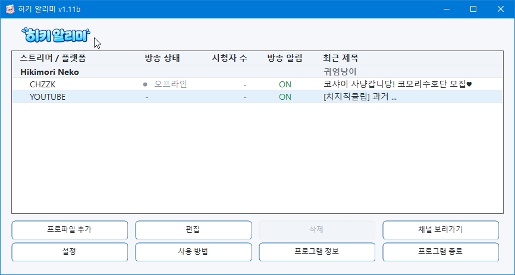
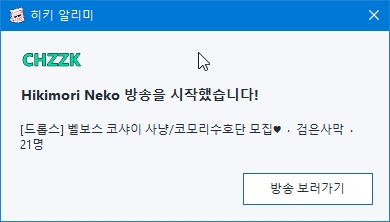

# HIKI Notifier

**English | [한국어](#한국어)**

A lightweight Windows utility for receiving notifications when CHZZK channels go live.

HIKI Notifier includes a built-in **Hikimori Neko** profile and also allows you to register additional CHZZK channels manually.

No NAVER or CHZZK login is required.

> **Unofficial fan-made utility**  
> HIKI Notifier is not affiliated with or endorsed by NAVER or CHZZK.

---

## Screenshots

### Main Window



### Live Notification



---

## Features

- CHZZK LIVE / OFFLINE status monitoring
- Desktop notification when a registered channel goes live
- Current viewer count
- Current stream title
- Multiple channel profiles
- Per-profile notification ON / OFF
- Immediate one-time notification when alerts are re-enabled while a channel is already LIVE
- Open streams directly from the notification window
- Quick double-click actions from the main channel list
- System tray operation
- Optional startup with Windows
- Built-in notification sound
- Custom WAV notification sound
- Silent mode
- Korean / English UI
- No NAVER login required

---

## Basic Usage

### 1. Download and run

Download the latest ZIP file from the **Releases** section.

Current release:

`HIKI Notifier 1.00c.zip`

Extract the ZIP file to any folder and run:

`HIKI Notifier.exe`

No installer is required.

---

### 2. Built-in Hikimori Neko profile

The **Hikimori Neko** profile is included automatically.

The built-in profile cannot be deleted and its channel URL cannot be changed.

Stream notifications can still be freely enabled or disabled.

---

### 3. Add another CHZZK channel

Press **Add Profile** in the main window.

Enter the CHZZK LIVE URL of the channel you want to monitor.

Example:

```text
https://chzzk.naver.com/live/CHANNEL_ID
```

Save the profile.

HIKI Notifier will then monitor the registered channel together with the built-in profile.

---

### 4. Receive a live notification

When a registered channel goes LIVE, HIKI Notifier displays a desktop notification.

The notification displays:

- Channel name
- Stream title
- Current viewer count

Press **Watch Live** to open the stream in your default browser.

Clicking other parts of the notification does not open the browser.

---

## Main Window

The main channel list displays:

- Channel name
- Stream status
- Viewer count
- Notification ON / OFF
- Stream title

### Double-click actions

Double-click any of the following:

- **Channel name**
- **Stream status**
- **Viewer count**
- **Stream title**

→ Opens the channel's live page.

Double-click:

- **Notification ON / OFF**

→ Toggles notifications for that profile.

Notification settings can also be changed from the profile editor and the system tray menu.

---

## Notification Settings

Notifications can be enabled or disabled separately for each profile.

If a channel is already LIVE and its notification setting is changed from:

`OFF → ON`

HIKI Notifier immediately displays the current live notification once.

This can also be used to quickly check the current notification display.

---

## Notification Sound

The following notification sound modes are available:

- Built-in notification sound
- Custom WAV file
- Silent

Notification sound settings can be changed from the Settings window.

---

## System Tray

Closing or minimizing the main window does **not** exit HIKI Notifier.

The application continues running in the Windows system tray.

From the tray menu you can:

- Open HIKI Notifier
- Enable / disable notifications for each profile
- Open a registered stream
- Open program information
- Exit the application

To completely close HIKI Notifier, right-click the tray icon and select **Exit**.

---

## Start with Windows

HIKI Notifier can optionally start automatically with Windows.

This option can be enabled or disabled from the Settings window.

When started automatically, HIKI Notifier can remain in the system tray without requiring the main window to stay open.

---

## Stream Status Monitoring

HIKI Notifier periodically checks the current status of registered channels.

Possible states include:

- LIVE
- OFFLINE
- UNKNOWN

Temporary network errors are not automatically treated as OFFLINE.

This helps prevent false repeated notifications caused by temporary connection problems.

---

## Languages

Currently supported:

- 한국어
- English

The UI language can be changed from the Settings window.

---

## System Requirements

- 64-bit Windows 10 or Windows 11
- x64 processor
- .NET Framework 4.8

---

## Download

Download the latest version from the **Releases** section of this repository.

Current release:

`HIKI Notifier 1.00c.zip`

Extract the ZIP file and run:

`HIKI Notifier.exe`

No installer is required.

---

## Development

HIKI Notifier is built with:

- C#
- .NET Framework 4.8
- Windows Forms
- x64

The application is designed to remain lightweight while running continuously in the background.

---

## Version

Current version:

**1.00c**

---

## Developer

**Eltax**

---

## Special Thanks

### Hikimori Neko

The person who inspired this project.

---

## Disclaimer

HIKI Notifier is an unofficial fan-made utility.

It is not affiliated with or endorsed by NAVER, CHZZK, or their respective operators.

All service names and trademarks belong to their respective owners.

Changes to service APIs or web structures may cause some features to stop working correctly.

---

## License

No open-source license is currently provided for this repository.

**Copyright © Eltax. All rights reserved.**

Third-party trademarks, service names, and externally sourced assets remain subject to the rights and license terms of their respective owners.

---

# 한국어

**[English](#hiki-notifier) | 한국어**

**HIKI Notifier**는 치지직(CHZZK) 방송 시작을 빠르게 확인하기 위해 만든  
가벼운 Windows용 방송 알림 유틸리티입니다.

**Hikimori Neko** 방송 프로파일이 기본으로 포함되어 있으며,  
원하는 다른 치지직 채널도 직접 등록하여 방송 시작 알림을 받을 수 있습니다.

네이버 또는 치지직 로그인이 필요하지 않습니다.

> **비공식 팬메이드 유틸리티**  
> HIKI Notifier는 NAVER / CHZZK의 공식 프로그램이 아닙니다.

---

## 스크린샷

### 메인 화면


### 방송 시작 알림


---

## 주요 기능

- 치지직 방송 LIVE / OFFLINE 상태 확인
- 방송 시작 시 데스크톱 알림
- 현재 시청자 수 표시
- 현재 방송 제목 표시
- 여러 방송 채널 프로파일 등록
- 프로파일별 방송 알림 ON / OFF
- 방송 중 알림을 OFF → ON으로 변경하면 즉시 1회 재알림
- 알림창에서 **방송 보러가기** 지원
- 메인 목록 더블클릭으로 빠른 방송 이동 / 알림 토글
- 시스템 트레이 상주
- Windows 시작 시 자동 실행 옵션
- 프로그램 기본 알림음
- 사용자 지정 WAV 알림음
- 무음 모드
- 한국어 / English UI
- 네이버 로그인 없이 사용 가능

---

## 기본 사용법

### 1. 다운로드 및 실행

이 저장소의 **Releases** 메뉴에서 최신 ZIP 파일을 다운로드합니다.

현재 배포 버전:

`HIKI Notifier 1.00c.zip`

원하는 폴더에 압축을 풀고:

`HIKI Notifier.exe`

를 실행하면 됩니다.

별도의 설치 프로그램은 필요하지 않습니다.

---

### 2. Hikimori Neko 기본 프로파일

**Hikimori Neko** 프로파일은 프로그램에 기본으로 포함되어 있습니다.

기본 프로파일은 삭제하거나 채널 주소를 변경할 수 없습니다.

방송 알림 ON / OFF 설정은 자유롭게 변경할 수 있습니다.

---

### 3. 다른 치지직 채널 추가

메인 화면에서 **프로파일 추가** 버튼을 누릅니다.

알림을 받고 싶은 채널의 치지직 LIVE 주소를 입력합니다.

예:

```text
https://chzzk.naver.com/live/CHANNEL_ID
```

프로파일을 저장하면 해당 채널도 기본 프로파일과 함께 방송 상태를 확인합니다.

---

### 4. 방송 시작 알림 받기

등록된 채널이 방송을 시작하면 데스크톱 알림창이 표시됩니다.

알림창에서는 다음 정보를 확인할 수 있습니다.

- 채널 이름
- 방송 제목
- 현재 시청자 수

**방송 보러가기** 버튼을 누르면 기본 브라우저에서 해당 방송 페이지가 열립니다.

알림창의 다른 부분을 클릭해도 브라우저는 열리지 않습니다.

---

## 메인 화면

메인 프로파일 목록에서는 다음 정보를 확인할 수 있습니다.

- 채널 이름
- 방송 상태
- 시청자 수
- 방송 알림 ON / OFF
- 방송 제목

### 더블클릭 동작

다음 항목을 더블클릭하면:

- **채널 이름**
- **방송 상태**
- **시청자 수**
- **방송 제목**

→ 해당 채널의 방송 페이지가 열립니다.

다음 항목을 더블클릭하면:

- **방송 알림 ON / OFF**

→ 해당 프로파일의 방송 알림을 ON / OFF로 전환합니다.

알림 설정은 프로파일 편집창과 트레이 메뉴에서도 변경할 수 있습니다.

---

## 방송 알림 설정

각 프로파일마다 방송 알림을 개별적으로 켜거나 끌 수 있습니다.

현재 방송 중인 채널의 알림을:

`OFF → ON`

으로 변경하면 현재 방송에 대한 알림창이 즉시 1회 표시됩니다.

현재 알림창이 어떻게 표시되는지 다시 확인할 때도 사용할 수 있습니다.

---

## 알림음

다음 세 가지 알림음 방식을 사용할 수 있습니다.

- 프로그램 기본 알림음
- 사용자 지정 WAV
- 무음

설정 화면에서 원하는 알림 방식을 선택할 수 있습니다.

---

## 시스템 트레이

메인 창을 닫거나 최소화해도 HIKI Notifier는 종료되지 않습니다.

프로그램은 Windows 시스템 트레이에서 계속 실행됩니다.

트레이 메뉴에서는 다음 기능을 사용할 수 있습니다.

- HIKI Notifier 열기
- 프로파일별 방송 알림 ON / OFF
- 방송 보러가기
- 프로그램 정보
- 프로그램 종료

프로그램을 완전히 종료하려면 트레이 아이콘을 우클릭한 뒤  
**프로그램 종료**를 선택하세요.

---

## Windows 시작 시 자동 실행

설정 화면에서 Windows 시작 시 HIKI Notifier가 자동으로 실행되도록 설정할 수 있습니다.

자동 실행 상태에서는 메인 창을 계속 열어둘 필요 없이  
트레이에서 방송 상태를 확인할 수 있습니다.

---

## 방송 상태 확인

HIKI Notifier는 일정 간격으로 등록된 채널의 방송 상태를 확인합니다.

방송 상태는 다음과 같이 표시될 수 있습니다.

- LIVE
- OFFLINE
- UNKNOWN

일시적인 네트워크 오류가 발생했다고 해서  
채널을 즉시 OFFLINE으로 처리하지 않습니다.

이를 통해 일시적인 연결 문제로 인한 잘못된 재알림을 줄입니다.

---

## 언어

현재 지원 언어:

- 한국어
- English

UI 언어는 설정 화면에서 변경할 수 있습니다.

---

## 시스템 요구 사항

- 64비트 Windows 10 또는 Windows 11
- x64 프로세서
- .NET Framework 4.8

---

## 다운로드

이 저장소의 **Releases** 메뉴에서 최신 버전을 받을 수 있습니다.

현재 배포 버전:

`HIKI Notifier 1.00c.zip`

압축을 풀고:

`HIKI Notifier.exe`

를 실행하면 됩니다.

별도의 설치 프로그램은 필요하지 않습니다.

---

## 개발 환경

HIKI Notifier는 다음 환경을 기반으로 제작되었습니다.

- C#
- .NET Framework 4.8
- Windows Forms
- x64

백그라운드에서 계속 실행되는 프로그램인 만큼  
가볍고 단순하게 동작하는 것을 목표로 제작되었습니다.

---

## 버전

현재 버전:

**1.00c**

---

## 개발자

**Eltax**

---

## Special Thanks

### Hikimori Neko

이 프로그램을 만들게 된 계기가 되어준 사람.

---

## 면책 고지

HIKI Notifier는 비공식 팬메이드 유틸리티입니다.

NAVER, CHZZK 또는 관련 운영사와 공식적으로 제휴하거나  
승인받은 프로그램이 아닙니다.

각 서비스명과 상표는 해당 권리자에게 귀속됩니다.

서비스 측의 API 또는 웹 구조가 변경될 경우  
일부 기능이 정상적으로 동작하지 않을 수 있습니다.

---

## 라이선스

이 저장소에는 현재 별도의 오픈소스 라이선스가 제공되지 않습니다.

**Copyright © Eltax. All rights reserved.**

제3자 상표, 서비스명 및 외부 출처 자산은  
각 권리자와 해당 라이선스 조건에 따릅니다.
