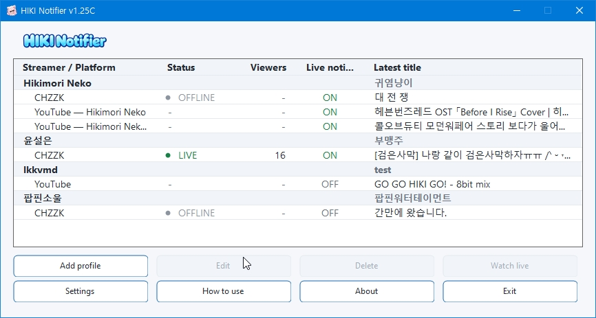
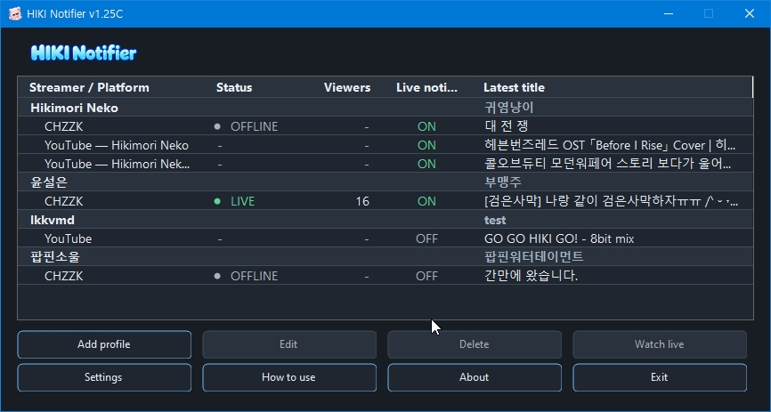
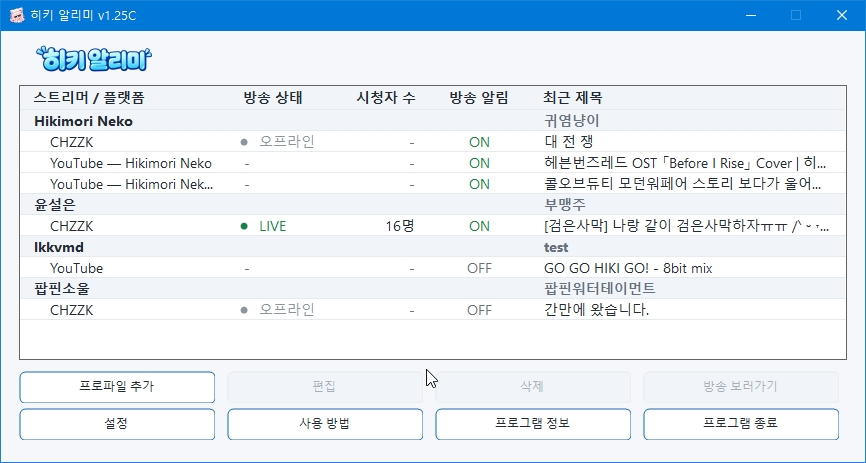
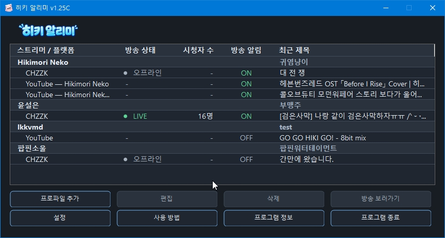

# HIKI Notifier

**English | [한국어](#한국어) | [日本語](#日本語)**

A lightweight Windows notification utility for multiple streaming platforms.

**Supported platforms:** CHZZK · YouTube · RPLAY · Twitch · SOOP · CIME · Kick · TwitCasting

- **CHZZK** — LIVE status, stream title, viewer count, and live notifications
- **YouTube** — New video and Shorts notifications
- **RPLAY** — LIVE status and live notifications
- **Twitch** — LIVE status and live notifications
- **SOOP** — LIVE status and live notifications
- **CIME** — LIVE status, stream title, viewer information, and live notifications
- **Kick** — LIVE status, stream title, viewer count, and live notifications
- **TwitCasting** — LIVE status, stream title, and live notifications

HIKI Notifier includes a built-in **Hikimori Neko** profile with one CHZZK channel and two YouTube channels.

Additional streamer profiles can be added manually, and one profile can contain multiple different channels from the same platform.

No account login is required for supported platform monitoring.

> **Unofficial fan-made utility**  
> HIKI Notifier is not affiliated with or endorsed by any supported platform or its operator.

---

## Screenshots

### Standard Theme



### Dark Theme



### Notification Appearance


### Notification Example


---

## Features

- LIVE / OFFLINE / UNKNOWN status monitoring
- Desktop notifications when registered live channels go LIVE
- Stream title, category, and viewer information when available
- YouTube new video and Shorts notifications
- Built-in Hikimori Neko profile with **1 CHZZK + 2 YouTube channels**
- Multiple streamer profiles
- Multiple channels per profile, including multiple channels from the same platform
- Per-channel notification ON / OFF
- Optional per-channel automatic stream-page opening
- Open the relevant stream or content page by clicking the notification
- Per-profile notification backgrounds and text colors
- JPG / JPEG / animated GIF notification backgrounds
- Adjustable header and content font sizes
- Adjustable notification opacity and display duration
- Notification preview before saving
- Standard and Dark main-window themes
- Built-in categorized Help window
- Built-in notification sound, custom WAV, and silent mode
- System tray operation
- Optional startup with Windows
- English, Korean, and Japanese language packs

---

## Download and Run

Download the latest ZIP from:

https://github.com/laikal/HIKI-Notifier/releases

Extract the full contents of the ZIP and run:

`HIKI Notifier.exe`

No installer is required.

When updating an existing installation, replace the distributed program files together rather than replacing only the EXE. Your existing `settings.json` and `Profiles` data can be kept.

---

## Built-in Hikimori Neko Profile

The **Hikimori Neko** profile is included automatically.

It contains:

```text
Hikimori Neko
├─ CHZZK
├─ YouTube — Main
└─ YouTube — Replay
```

The built-in profile and its predefined channel addresses are protected from deletion or modification.

Notification settings and notification appearance can still be changed.

---

## Add a Streamer Profile

Press **Add Profile** in the main window.

Enter a streamer name, optional memo, and one or more supported channel URLs.

Example:

```text
https://chzzk.naver.com/live/CHANNEL_ID
https://www.youtube.com/@HANDLE
https://www.twitch.tv/CHANNEL
https://kick.com/CHANNEL
https://twitcasting.tv/CHANNEL
```

Supported platform URLs are recognized automatically.

A single streamer profile can contain multiple linked channels, including multiple different channels from the same platform.

---

## Notifications

Notifications can be enabled or disabled separately for each channel.

For supported live-stream platforms, a notification appears when a newly detected broadcast starts.

Depending on the platform, a notification can include:

- Streamer name
- Stream title
- Category
- Viewer count

For YouTube, HIKI Notifier can notify you when a new video or Shorts content is detected.

Click anywhere on a notification to open the relevant stream or content page in your default browser.

---

## Automatic Stream Page Opening

Each supported live channel can optionally open its stream page automatically when a new broadcast starts.

This option is configured per channel and is disabled by default.

It is intended for newly detected broadcast starts and does not simply open a page every time the application sees a channel in LIVE state.

---

## Notification Appearance

Each streamer profile can use its own notification background and text colors.

### Per-profile settings

- Background image
- Text color
- Text outline color

### Shared settings

- Header font size: **12–20 pt**
- Content font size: **10–16 pt**
- Notification opacity: **50–100%**
- Notification duration: **3–30 seconds**

Supported background formats:

- JPG
- JPEG
- GIF

Background image requirements:

- Exactly **480 × 270**
- Maximum file size **15 MB**
- Animated GIF backgrounds repeat while the notification is visible

You can test appearance changes before saving them.

The notification title can use up to two lines, and the notification layout is designed to keep text readable over custom backgrounds.

---

## Main Window Themes

Two main-window themes are available:

- **Standard** — original HIKI Notifier appearance
- **Dark** — dark color theme

The theme can be changed from **Settings**.

---

## Help

The built-in **Help** window provides categorized guides for:

- Quick start
- Streamer profiles
- Adding channels
- Supported platforms
- Notifications
- Automatic stream opening
- Notification appearance
- Backup
- Troubleshooting
- Other common usage topics

---

## Notification Sound

Available modes:

- Built-in notification sound
- Custom WAV file
- Silent

Notification sound settings can be changed from **Settings**.

---

## YouTube Monitoring

HIKI Notifier can notify you about newly published YouTube videos and Shorts without requiring a Google or YouTube login.

Previously detected content is not repeatedly notified during normal use.

Because YouTube monitoring depends on publicly available YouTube data, future changes to YouTube may require an update to HIKI Notifier.

---

## System Tray

Closing or minimizing the main window does **not** exit HIKI Notifier.

The application continues running in the Windows system tray.

From the tray menu you can:

- Open HIKI Notifier
- Access available channel actions
- Enable or disable channel notifications
- Open available stream/content pages
- Open program information
- Exit the application

To completely close HIKI Notifier, right-click the tray icon and select **Exit**.

---

## Start with Windows

HIKI Notifier can optionally start automatically with Windows.

This option can be changed from **Settings**.

---

## Profile Data and Backup

Streamer profiles are stored under:

`Profiles\`

Global application settings are stored in:

`settings.json`

For a simple manual backup, close HIKI Notifier and back up both:

```text
Profiles\
settings.json
```

Profile appearance files are stored together with the profile data.

---

## Languages

Included language packs:

- English
- 한국어
- 日本語

Additional INI language packs can be added under:

```text
lang\*.ini
```

If a translation key is missing, English is used as the fallback.

---

## System Requirements

- 64-bit Windows 10 or Windows 11
- x64 processor
- .NET Framework 4.8

---

## Developer

**Eltax**

---

## Special Thanks

### Hikimori Neko

The person who inspired this project.

---

## Disclaimer

HIKI Notifier is an unofficial fan-made utility.

It is not affiliated with or endorsed by any supported platform or its operator.

All service names and trademarks belong to their respective owners.

Changes to service APIs, public feeds, or web structures may cause some features to stop working correctly.

---

## License

No open-source license is currently provided for this repository.

**Copyright © Eltax. All rights reserved.**

Third-party trademarks, service names, and externally sourced assets remain subject to the rights and license terms of their respective owners.

---

# 한국어

**[English](#hiki-notifier) | 한국어 | [日本語](#日本語)**

**HIKI Notifier**는 여러 스트리밍 플랫폼의 방송 및 새 콘텐츠를 확인하기 위한 가벼운 Windows용 알림 유틸리티입니다.

**지원 플랫폼:** CHZZK · YouTube · RPLAY · Twitch · SOOP · CIME · Kick · TwitCasting

- **CHZZK** — 방송 상태, 방송 제목, 시청자 수 및 방송 시작 알림
- **YouTube** — 새 영상 및 Shorts 알림
- **RPLAY** — 방송 상태 및 방송 시작 알림
- **Twitch** — 방송 상태 및 방송 시작 알림
- **SOOP** — 방송 상태 및 방송 시작 알림
- **CIME(씨미)** — 방송 상태, 방송 제목, 시청자 정보 및 방송 시작 알림
- **Kick** — 방송 상태, 방송 제목, 시청자 수 및 방송 시작 알림
- **TwitCasting** — 방송 상태, 방송 제목 및 방송 시작 알림

기본 **Hikimori Neko** 프로파일에는 CHZZK 1개와 YouTube 2개 채널이 포함되어 있습니다.

다른 스트리머 프로파일을 직접 추가할 수 있으며, 하나의 프로파일에 같은 플랫폼의 서로 다른 채널을 여러 개 등록할 수도 있습니다.

지원 플랫폼의 방송 상태 확인에는 계정 로그인이 필요하지 않습니다.

> **비공식 팬메이드 유틸리티**  
> HIKI Notifier는 지원 플랫폼 또는 관련 운영사의 공식 프로그램이 아닙니다.

---

## 스크린샷

### 기본 테마



### 다크 테마



### 알림창 꾸미기


### 알림창 예시


---

## 주요 기능

- 지원 라이브 플랫폼의 LIVE / OFFLINE / UNKNOWN 상태 확인
- 등록한 라이브 채널의 방송 시작 알림
- 플랫폼에 따라 방송 제목, 카테고리 및 시청자 정보 표시
- YouTube 새 영상 및 Shorts 알림
- Hikimori Neko **CHZZK 1개 + YouTube 2개** 기본 프로파일
- 여러 스트리머 프로파일 등록
- 하나의 프로파일에 여러 채널 등록 및 동일 플랫폼 다중 채널 지원
- 채널별 알림 ON / OFF
- 채널별 방송 시작 시 페이지 자동 열기
- 알림창 클릭으로 방송 또는 콘텐츠 페이지 열기
- 프로파일별 알림 배경 및 글자 색 설정
- JPG / JPEG / 움직이는 GIF 알림 배경
- 헤더 / 본문 글자 크기 조절
- 알림창 투명도 및 표시 시간 조절
- 저장 전 알림창 테스트
- 기본 / 다크 메인 화면 테마
- 항목별 내장 도움말
- 기본 알림음 / 사용자 WAV / 무음
- 시스템 트레이 상주
- Windows 시작 시 자동 실행
- English / 한국어 / 日本語 언어팩

---

## 다운로드 및 실행

최신 ZIP 파일은 다음 페이지에서 받을 수 있습니다.

https://github.com/laikal/HIKI-Notifier/releases

ZIP 파일의 전체 내용을 압축 해제한 뒤:

`HIKI Notifier.exe`

를 실행하면 됩니다.

별도의 설치 프로그램은 필요하지 않습니다.

기존 버전에서 업데이트할 때는 EXE 하나만 교체하지 말고 배포 ZIP의 프로그램 파일 전체를 함께 교체하세요. 기존 `settings.json`과 `Profiles` 데이터는 그대로 유지할 수 있습니다.

---

## Hikimori Neko 기본 프로파일

**Hikimori Neko** 프로파일은 프로그램에 기본으로 포함되어 있습니다.

구성:

```text
Hikimori Neko
├─ CHZZK
├─ YouTube — 메인
└─ YouTube — 다시보기
```

기본 프로파일과 미리 등록된 채널 주소는 삭제하거나 변경할 수 없습니다.

각 채널의 알림 설정과 알림창 꾸미기는 변경할 수 있습니다.

---

## 다른 스트리머 프로파일 추가

메인 화면에서 **프로파일 추가**를 누릅니다.

스트리머 이름, 선택 사항인 메모, 하나 이상의 지원 채널 주소를 입력할 수 있습니다.

예:

```text
https://chzzk.naver.com/live/CHANNEL_ID
https://www.youtube.com/@HANDLE
https://www.twitch.tv/CHANNEL
https://kick.com/CHANNEL
https://twitcasting.tv/CHANNEL
```

지원되는 플랫폼 주소는 자동으로 인식됩니다.

하나의 스트리머 프로파일에 여러 채널을 연결할 수 있으며, 같은 플랫폼의 서로 다른 채널도 여러 개 등록할 수 있습니다.

---

## 알림

각 채널의 알림을 개별적으로 켜거나 끌 수 있습니다.

지원되는 라이브 플랫폼에서 새 방송 시작이 확인되면 데스크톱 알림창이 표시됩니다.

플랫폼에 따라 다음 정보가 표시될 수 있습니다.

- 스트리머 이름
- 방송 제목
- 카테고리
- 현재 시청자 수

YouTube에서는 새 영상 또는 Shorts가 확인되면 새 콘텐츠 알림을 받을 수 있습니다.

알림창 어디든 클릭하면 해당 방송 또는 콘텐츠 페이지를 기본 브라우저에서 열 수 있습니다.

---

## 방송 시작 시 페이지 자동 열기

지원되는 라이브 채널은 새 방송이 시작될 때 해당 방송 페이지를 자동으로 열도록 설정할 수 있습니다.

이 옵션은 채널별로 설정하며 기본값은 OFF입니다.

단순히 프로그램이 LIVE 상태를 확인할 때마다 페이지를 여는 기능은 아니며 새 방송 시작을 기준으로 동작합니다.

---

## 알림창 꾸미기

각 스트리머 프로파일마다 서로 다른 알림 배경과 글자 색을 사용할 수 있습니다.

### 프로파일별 설정

- 배경 이미지
- 글자 색
- 글자 외곽선 색

### 전체 알림창 공통 설정

- 헤더 글자 크기: **12~20 pt**
- 본문 글자 크기: **10~16 pt**
- 알림창 투명도: **50~100%**
- 알림 표시 시간: **3~30초**

지원하는 배경 형식:

- JPG
- JPEG
- GIF

배경 이미지 조건:

- 정확히 **480 × 270**
- 최대 **15 MB**
- 움직이는 GIF는 알림창이 표시되는 동안 반복 재생

설정을 저장하기 전에 현재 변경값으로 알림창을 테스트할 수 있습니다.

방송 및 콘텐츠 제목은 최대 2줄까지 표시되며, 사용자 지정 배경에서도 글자를 읽기 쉽도록 알림창이 구성되어 있습니다.

---

## 메인 화면 테마

두 가지 메인 화면 테마를 사용할 수 있습니다.

- **기본** — 기존 HIKI Notifier 화면
- **다크** — 어두운 색상 테마

테마는 **설정**에서 변경할 수 있습니다.

---

## 사용 방법 / 도움말

프로그램 안의 **사용 방법** 화면에서 다음 내용을 항목별로 확인할 수 있습니다.

- 빠른 시작
- 스트리머 프로파일
- 채널 추가
- 지원 플랫폼
- 알림 설정
- 방송 페이지 자동 열기
- 알림창 꾸미기
- 백업
- 문제 해결
- 기타 주요 사용법

---

## 알림음

다음 방식을 사용할 수 있습니다.

- 프로그램 기본 알림음
- 사용자 지정 WAV
- 무음

알림음은 **설정**에서 변경할 수 있습니다.

---

## YouTube 새 콘텐츠 확인

HIKI Notifier는 Google 또는 YouTube 로그인 없이 새 YouTube 영상과 Shorts를 확인할 수 있습니다.

이미 확인된 콘텐츠는 정상적인 사용 중 반복해서 알리지 않습니다.

YouTube에서 공개하는 정보에 의존하는 기능이므로 향후 YouTube 측 변경에 따라 프로그램 업데이트가 필요할 수 있습니다.

---

## 시스템 트레이

메인 창을 닫거나 최소화해도 HIKI Notifier는 종료되지 않습니다.

프로그램은 Windows 시스템 트레이에서 계속 동작합니다.

트레이 메뉴에서는 다음 기능을 사용할 수 있습니다.

- HIKI Notifier 열기
- 사용 가능한 채널 기능
- 채널별 알림 ON / OFF
- 방송 / 콘텐츠 페이지 열기
- 프로그램 정보
- 프로그램 종료

완전히 종료하려면 트레이 아이콘을 우클릭한 뒤 **프로그램 종료**를 선택하세요.

---

## Windows 시작 시 자동 실행

HIKI Notifier를 Windows 시작 시 자동으로 실행하도록 설정할 수 있습니다.

이 옵션은 **설정**에서 변경할 수 있습니다.

---

## 프로파일 데이터와 백업

스트리머 프로파일은 다음 폴더에 저장됩니다.

`Profiles\`

프로그램 전체 설정은 다음 파일에 저장됩니다.

`settings.json`

간단히 백업하려면 HIKI Notifier를 종료한 뒤 다음 두 항목을 보관하세요.

```text
Profiles\
settings.json
```

알림 배경 등 프로파일별 꾸미기 파일도 프로파일 데이터와 함께 저장됩니다.

---

## 언어

기본 제공 언어팩:

- English
- 한국어
- 日本語

추가 INI 언어팩은 다음 위치에 넣을 수 있습니다.

```text
lang\*.ini
```

번역 항목이 없는 경우 English 언어팩을 기본값으로 사용합니다.

---

## 시스템 요구 사항

- 64비트 Windows 10 또는 Windows 11
- x64 프로세서
- .NET Framework 4.8

---

## 개발자

**Eltax**

---

## Special Thanks

### Hikimori Neko

이 프로그램을 만들게 된 계기가 되어준 사람.

---

## 면책 고지

HIKI Notifier는 비공식 팬메이드 유틸리티입니다.

지원 플랫폼 또는 관련 운영사와 공식적으로 제휴하거나 승인받은 프로그램이 아닙니다.

각 서비스명과 상표는 해당 권리자에게 귀속됩니다.

서비스 측 API, 공개 피드 또는 웹 구조가 변경될 경우 일부 기능이 정상적으로 동작하지 않을 수 있습니다.

---

## 라이선스

이 저장소에는 현재 별도의 오픈소스 라이선스가 제공되지 않습니다.

**Copyright © Eltax. All rights reserved.**

제3자 상표, 서비스명 및 외부 출처 자산은 각 권리자와 해당 라이선스 조건에 따릅니다.

---

# 日本語

**[English](#hiki-notifier) | [한국어](#한국어) | 日本語**

**HIKI Notifier** は、複数の配信プラットフォームの配信状況や新着コンテンツを確認できる軽量なWindows向け通知ユーティリティです。

**対応プラットフォーム:** CHZZK · YouTube · RPLAY · Twitch · SOOP · CIME · Kick · TwitCasting

- **CHZZK** — 配信状態、配信タイトル、視聴者数、配信開始通知
- **YouTube** — 新着動画・Shorts通知
- **RPLAY** — 配信状態、配信開始通知
- **Twitch** — 配信状態、配信開始通知
- **SOOP** — 配信状態、配信開始通知
- **CIME** — 配信状態、配信タイトル、視聴者情報、配信開始通知
- **Kick** — 配信状態、配信タイトル、視聴者数、配信開始通知
- **TwitCasting** — 配信状態、配信タイトル、配信開始通知

標準の **Hikimori Neko** プロフィールには、CHZZK 1チャンネルとYouTube 2チャンネルが含まれています。

ほかの配信者プロフィールを追加でき、1つのプロフィールに同じプラットフォームの別チャンネルを複数登録することもできます。

対応プラットフォームの確認にアカウントログインは必要ありません。

> **非公式ファンメイドユーティリティ**  
> HIKI Notifierは、各対応プラットフォームまたはその運営会社が公式に提供・承認するソフトウェアではありません。

---

## スクリーンショット

### 標準テーマ


### ダークテーマ


### 通知カスタマイズ


### 通知例


---

## 主な機能

- 対応ライブ配信プラットフォームのLIVE / OFFLINE / UNKNOWN状態を確認
- 登録したライブチャンネルの配信開始通知
- プラットフォームに応じて配信タイトル、カテゴリ、視聴者情報を表示
- YouTubeの新着動画・Shorts通知
- Hikimori Nekoの **CHZZK 1チャンネル + YouTube 2チャンネル** 標準プロフィール
- 複数の配信者プロフィール
- 1つのプロフィールに複数チャンネルを登録可能
- 同一プラットフォームの別チャンネルを複数登録可能
- チャンネルごとの通知ON / OFF
- チャンネルごとの配信ページ自動オープン
- 通知をクリックして配信・コンテンツページを開く
- プロフィールごとの通知背景・文字色設定
- JPG / JPEG / アニメーションGIF通知背景
- ヘッダー / 本文フォントサイズ調整
- 通知の透明度・表示時間調整
- 保存前の通知テスト
- 標準 / ダークテーマ
- カテゴリ別の内蔵ヘルプ
- 内蔵通知音 / カスタムWAV / 無音
- システムトレイ常駐
- Windows起動時の自動実行
- English / 한국어 / 日本語 言語パック

---

## ダウンロードと起動

最新版のZIPファイル:

https://github.com/laikal/HIKI-Notifier/releases

ZIPファイルの内容をすべて展開し、

`HIKI Notifier.exe`

を実行してください。

インストーラーは必要ありません。

既存バージョンから更新する場合は、EXEだけではなく配布ZIPのプログラムファイル一式を置き換えてください。既存の `settings.json` と `Profiles` データはそのまま利用できます。

---

## Hikimori Neko 標準プロフィール

**Hikimori Neko** プロフィールは最初から登録されています。

構成:

```text
Hikimori Neko
├─ CHZZK
├─ YouTube — Main
└─ YouTube — Replay
```

標準プロフィールと登録済みチャンネルURLは削除・変更できません。

各チャンネルの通知設定と通知外観は変更できます。

---

## ほかの配信者プロフィールを追加

メイン画面で **プロフィール追加** を選択します。

配信者名、任意のメモ、1つ以上の対応チャンネルURLを入力できます。

例:

```text
https://chzzk.naver.com/live/CHANNEL_ID
https://www.youtube.com/@HANDLE
https://www.twitch.tv/CHANNEL
https://kick.com/CHANNEL
https://twitcasting.tv/CHANNEL
```

対応しているプラットフォームURLは自動的に認識されます。

1つのプロフィールに複数のチャンネルを登録でき、同じプラットフォームの別チャンネルも複数登録できます。

---

## 通知

各チャンネルの通知は個別にON / OFFできます。

対応ライブ配信プラットフォームで新しい配信開始が確認されると、デスクトップ通知が表示されます。

プラットフォームによって次の情報が表示されます。

- 配信者名
- 配信タイトル
- カテゴリ
- 現在の視聴者数

YouTubeでは、新しい動画またはShortsが確認されると新着コンテンツ通知を受け取れます。

通知ウィンドウをクリックすると、対象の配信またはコンテンツページを既定のブラウザーで開けます。

---

## 配信開始時にページを自動で開く

対応するライブチャンネルでは、新しい配信開始時に配信ページを自動的に開くよう設定できます。

この設定はチャンネルごとに管理され、初期状態ではOFFです。

単にLIVE状態を確認するたびにページを開く機能ではなく、新しい配信開始を基準に動作します。

---

## 通知カスタマイズ

配信者プロフィールごとに異なる通知背景と文字色を設定できます。

### プロフィールごとの設定

- 背景画像
- 文字色
- 文字アウトライン色

### すべての通知に共通する設定

- ヘッダーフォントサイズ: **12～20 pt**
- 本文フォントサイズ: **10～16 pt**
- 通知透明度: **50～100%**
- 通知表示時間: **3～30秒**

対応背景形式:

- JPG
- JPEG
- GIF

背景画像の条件:

- 正確に **480 × 270**
- 最大 **15 MB**
- アニメーションGIFは通知表示中に繰り返し再生

保存前に現在の設定で通知をテストできます。

配信・コンテンツタイトルは最大2行まで表示され、カスタム背景上でも文字を読みやすいレイアウトになっています。

---

## メイン画面テーマ

2種類のテーマを利用できます。

- **標準** — 従来のHIKI Notifier画面
- **ダーク** — ダークカラーテーマ

テーマは **設定** から変更できます。

---

## ヘルプ

アプリ内の **ヘルプ** 画面では、次の内容をカテゴリ別に確認できます。

- クイックスタート
- 配信者プロフィール
- チャンネル追加
- 対応プラットフォーム
- 通知設定
- 配信ページ自動オープン
- 通知カスタマイズ
- バックアップ
- トラブルシューティング
- その他の主な使い方

---

## 通知音

利用できるモード:

- 内蔵通知音
- カスタムWAV
- 無音

通知音は **設定** から変更できます。

---

## YouTube新着コンテンツ

HIKI NotifierはGoogleまたはYouTubeへのログインなしで、新しいYouTube動画とShortsを確認できます。

通常の利用中、すでに確認済みのコンテンツを繰り返し通知することはありません。

YouTubeが公開している情報を利用する機能のため、YouTube側の変更によってはHIKI Notifierの更新が必要になる場合があります。

---

## システムトレイ

メインウィンドウを閉じたり最小化したりしてもHIKI Notifierは終了しません。

アプリはWindowsのシステムトレイで動作を続けます。

トレイメニューでは次の操作ができます。

- HIKI Notifierを開く
- 利用可能なチャンネル操作
- チャンネルごとの通知ON / OFF
- 配信 / コンテンツページを開く
- プログラム情報
- アプリを終了

完全に終了するには、トレイアイコンを右クリックして **終了** を選択してください。

---

## Windows起動時に自動実行

HIKI NotifierをWindows起動時に自動実行するよう設定できます。

この設定は **設定** から変更できます。

---

## プロフィールデータとバックアップ

配信者プロフィール:

`Profiles\`

アプリ全体の設定:

`settings.json`

バックアップする場合はHIKI Notifierを終了して次の2項目を保存してください。

```text
Profiles\
settings.json
```

通知背景などのプロフィール別ファイルもプロフィールデータと一緒に保存されます。

---

## 言語

標準言語パック:

- English
- 한국어
- 日本語

追加のINI言語パックは次の場所に追加できます。

```text
lang\*.ini
```

翻訳項目がない場合はEnglishをフォールバックとして使用します。

---

## システム要件

- 64-bit Windows 10 または Windows 11
- x64プロセッサ
- .NET Framework 4.8

---

## 開発者

**Eltax**

---

## Special Thanks

### Hikimori Neko

このプロジェクトを作るきっかけをくれた人。

---

## 免責事項

HIKI Notifierは非公式のファンメイドユーティリティです。

各対応プラットフォームまたはその運営会社とは公式な提携関係になく、承認を受けたソフトウェアでもありません。

各サービス名および商標は、それぞれの権利者に帰属します。

サービス側のAPI、公開フィード、Web構造などが変更された場合、一部の機能が正常に動作しなくなる可能性があります。

---

## ライセンス

このリポジトリには現在、オープンソースライセンスは提供されていません。

**Copyright © Eltax. All rights reserved.**

第三者の商標、サービス名、および外部由来のアセットには、それぞれの権利者およびライセンス条件が適用されます。
